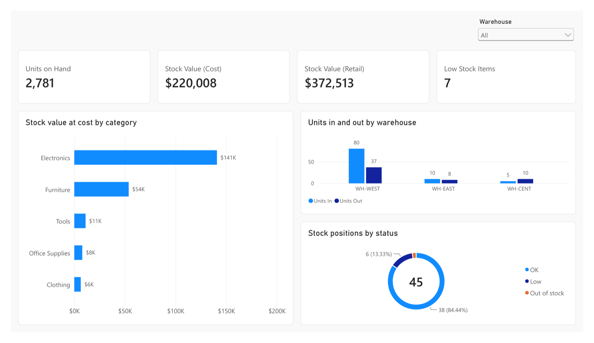
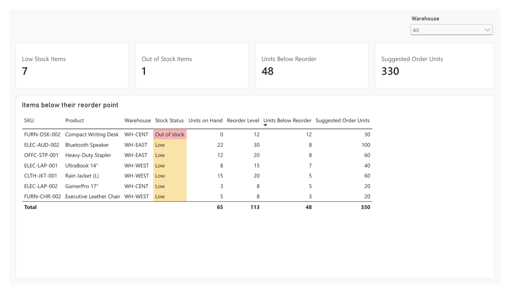
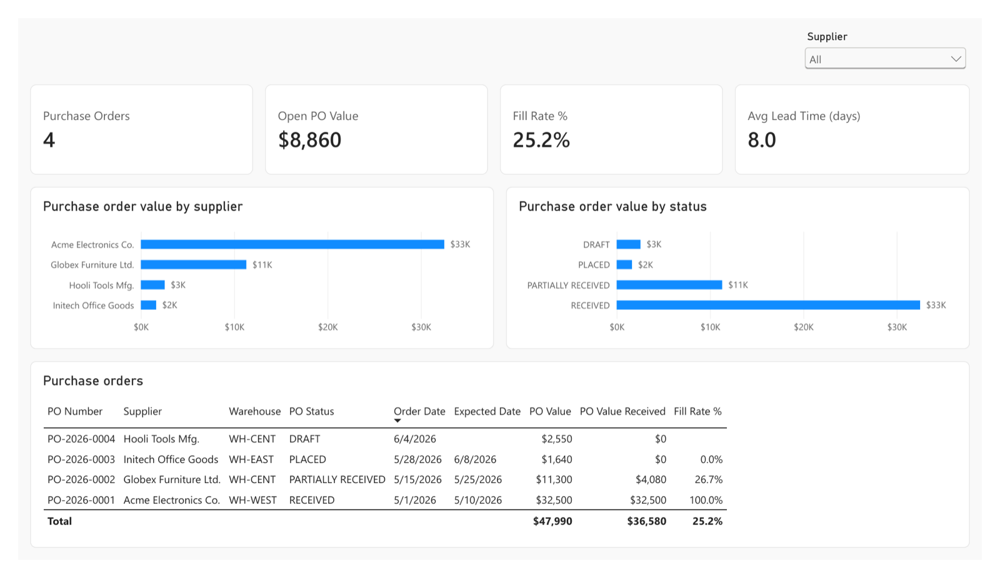

# Stockroom

A small internal inventory app: SQL Server, ASP.NET Core MVC, jQuery, and a
Power BI report — built on the inventory schema from
[Databases-and-Data-Platforms](https://github.com/jdoan5/Databases-and-Data-Platforms),
ported from PostgreSQL to T-SQL.

**Live demo:** https://ca-stockroom.nicesea-6ebff2dd.eastus.azurecontainerapps.io
— the first page after a quiet spell can take up to a minute while the database
wakes up (see [Azure](#azure)). It's shared, so go ahead and transfer stock.

**Power BI report:** [PDF](docs/Stockroom.pdf), [screenshots](#power-bi-report),
and the report itself as text in [`report/`](report).

## Stages

| # | Stage | Status |
|---|---|---|
| 1 | SQL Server database — schema, seed, views, triggers, stored procedures | ✅ done |
| 2 | ASP.NET Core MVC pages — dashboard, stock, low stock, purchase orders | ✅ done |
| 3 | jQuery forms — transfer stock, receive a purchase order | ✅ done |
| 4 | Live on Azure — Azure SQL Database, Container Apps | ✅ done |
| 5 | Power BI report — a reporting schema, a TMDL model and a PBIR report, all in git | ✅ done |
| 6 | Add product and Adjust stock pages | ✅ done |

## Run it

Needs Docker. On Apple Silicon, SQL Server runs under Rosetta (there is no arm64 image).

```bash
make env      # creates .env with a random SA password
              # then set ACCEPT_EULA=Y in .env if you accept the SQL Server license
make up       # start SQL Server
make db       # create the database and run db/01..06
make verify   # run the checks
make run      # web app at http://localhost:5271
```

The web app is ASP.NET Core MVC (.NET 10) — controllers and Razor views — reading
the database through [Dapper](https://github.com/DapperLib/Dapper). All queries go
through the reporting views in `db/03_views.sql`, parameterised, and run unchanged
in DataGrip. The connection string comes from `.env` via `make run`; no password is
stored in `appsettings.json`.

The write paths are jQuery over AJAX: **Transfer stock** validates in the browser
(jQuery unobtrusive validation, driven by the C# data annotations), posts to the
`transfer_stock` procedure, and live-reloads the product's stock panel; **Receive**
on the purchase orders page calls `receive_purchase_order` and reloads just the
table. **Add product** calls `add_product`, which refuses a duplicate SKU and gives
the new product a zero balance in every active warehouse, so it shows on Stock and Low
stock straight away. **Adjust stock** records a signed change with a reason (a
cycle count, damage, found stock) through `adjust_stock`: one `ADJUSTMENT` row in
the ledger, never an edit to the balance, and never below zero. Errors the
procedures `THROW` (50001–50034) are mapped to the form field they belong to, so
"Insufficient stock at WH-WEST: have 235, need 9999" appears under Quantity. Every
write endpoint requires an anti-forgery token.

Connect from DataGrip: `localhost:1433`, database `Stockroom`, user `sa`, password from `.env`.

## Azure

| Piece | What | Why |
|---|---|---|
| Database | Azure SQL Database, serverless, **free offer** (100,000 vCore-seconds and 32 GB a month) | Pauses when idle and stops rather than bills when the free allowance runs out |
| Web app | Azure Container Apps, 0.25 vCPU, scales to zero | Nothing runs, and nothing is billed, between visits |
| Image | `ghcr.io/jdoan5/stockroom`, built by [`image.yml`](.github/workflows/image.yml) on every push to `main` that changes `src/` | The .NET SDK builds the image itself (`/t:PublishContainer`), no Dockerfile |
| Cost guard | A $5/month budget on the resource group, emailing at 50%, 100% and a forecast of 100% | So a mistake shows up as an email, not a bill |

The same `db/` scripts run unchanged on Azure SQL, and `make azure-verify` passes on freshly seeded data.

**The app can't write to a table directly.** It connects as a contained database
user ([`db/07_app_user.sql`](db/07_app_user.sql)) that has `SELECT` on the schema
and `EXECUTE` on the four procedures — nothing else. `INSERT`, `UPDATE` and
`DELETE` fail with *permission denied*, so the rules in the procedures hold even
for someone holding the app's password. A grant belongs to one procedure, so after
adding a procedure, run `make azure-db` and then `make azure-app-user`. The
procedures can still write because they and the tables share an owner (SQL
Server's *ownership chaining*). The password lives in a Container Apps secret,
never in the repo.

A paused serverless database doesn't make the first connection wait: it refuses
it with error 40613 while it resumes, which can take up to a minute. So the app retries
opening the connection (never a command: re-running `transfer_stock` could move
stock twice) instead of showing the first visitor an error page; see
[`InventoryRepository.cs`](src/Stockroom.Web/Data/InventoryRepository.cs).

```bash
make azure-db           # load db/01..06 into Azure SQL; also re-seeds the live demo
make azure-verify       # run the checks there (re-seed first: they expect fresh data)
make azure-app-user     # create or re-key the app's database user
make azure-report-user  # create or re-key Power BI's read-only database user
make azure-allow-me     # move the firewall rule to this machine's public IP
make azure-deploy       # run the latest built image in the Container App
```

These need the `AZURE_*` values in `.env` (see `.env.example`), the local SQL
Server container running (its `sqlcmd` does the work), and `az login`.

## Power BI report



Three pages: **Overview** (stock value by category, units in and out by warehouse,
positions by status), **Low stock** (every balance below its reorder point, with
the suggested order quantity) and **Purchase orders** (value by supplier and
status, fill rate, lead time). The whole report is in the [PDF](docs/Stockroom.pdf).

| Low stock | Purchase orders |
|---|---|
|  |  |

**The data:** Power BI reads six star-schema views in their own schema,
[`rpt`](db/06_reporting.sql): three dimensions (product, warehouse, supplier) and
three facts (the current balances, the movement ledger, purchase order lines).
They're separate from the `dbo` views the web app uses, so each side can change
shape without breaking the other. Power BI connects as its own database user
([`db/08_report_user.sql`](db/08_report_user.sql)) that can `SELECT` from `rpt`
and nothing else: no tables, no procedures, no writes.

**The model:** Import mode (a DirectQuery report would wake the paused database
on every click), seven tables, seven single-direction relationships and 25 DAX
measures in a `_Measures` table. "Low stock" in the report is the same rule as the
web app's Low stock page, so the two agree as of each refresh. Every number was checked
against SQL over the same views: 2,781 units, $220,008 at cost, 7 low-stock
balances, a 25.2% fill rate on placed orders, and so on.

**The files:** the report is a Power BI Project (`.pbip`): the model in TMDL and
the report pages in PBIR, both plain text, so a change to a measure or a visual is
a readable diff. It was written as text first, then opened, refreshed and saved in
Power BI Desktop, which added its own IDs and settings.

To open it (Power BI Desktop is Windows-only; a Parallels VM works):

```bash
make report-local    # copy report/ to report.local/ with the server name filled in
```

Then open `report.local/Stockroom.pbip` in Power BI Desktop and click **Refresh**.
When asked, choose **Database** and enter the report user and password from `.env`.
After saving in Desktop, `make report-save` copies the changes back into `report/`.
The server name stays out of the repo: `report/` has a placeholder, and only the
gitignored `report.local/` has the real one. If refresh says your IP address isn't
allowed, run `make azure-allow-me`.

There's no live link to the report: Power BI's *Publish to web* needs a work or
school account and a Power BI license. The PDF and the screenshots stand in for it.

## Porting notes: PostgreSQL → SQL Server

The changes that affect behaviour, not just syntax:

- **Triggers fire once per statement**, not once per row. All affected rows arrive
  together in `inserted`, so the triggers are set-based. A row-at-a-time port
  silently updates only one row of a multi-row insert — swap one in and
  `make verify` shows a received PO whose second line never reached stock:
  `stapler 12->12, RECEIVED`.
- **Procedures aren't automatically atomic.** A Postgres function runs in one
  transaction; a SQL Server procedure autocommits each statement unless told
  otherwise. Both procedures use `SET XACT_ABORT ON` and an explicit transaction.
- **`TIMESTAMP` is not a date** in SQL Server — it's `rowversion`. Dates are `DATETIME2`.
- **No `ENUM`** — replaced with `CHECK` constraints.
- **No `BEFORE` triggers** — `last_updated` is maintained by an `AFTER UPDATE` trigger.
- **A self-referencing foreign key can't cascade**, so `categories.parent_id` has no `ON DELETE`.

Two bugs from the original schema are fixed here: a negative stock adjustment
(shrinkage) can now be recorded, and shipping stock that isn't there now fails
instead of silently leaving a balance of zero.

## License

MIT
